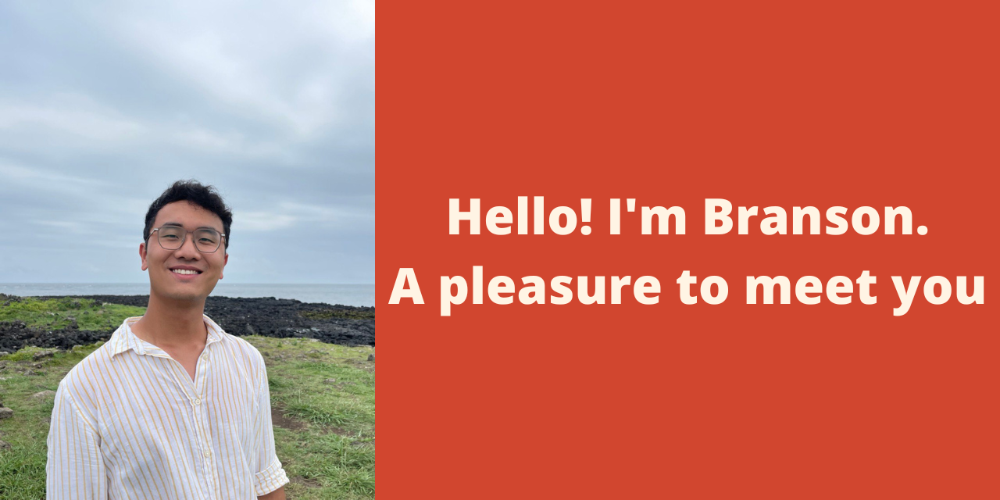
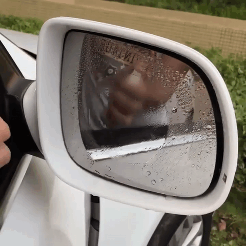
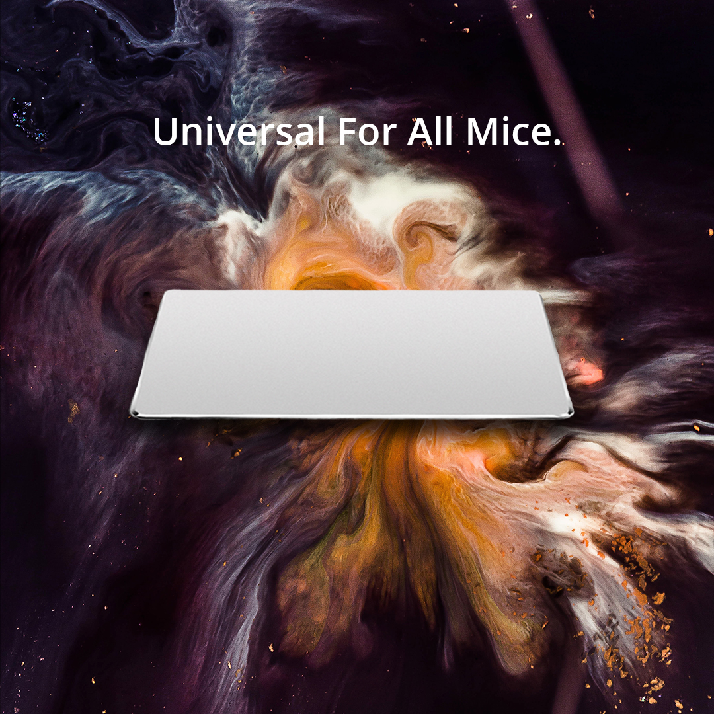

<h1> A bit about myself </h1>
<h3> Aspirations </h3> 

- Work in NYC
- Develop Software that positively impacts others
- Start my own Startup

<h3>Highlights: </h3>

- Started **Singapore's FIRST Group-focused itinerary generator**: Incubated under **Japanese MNC's Corporate Incubator** Program
- **Mentored by Venture Capitalist Firm TRIVE**: [Check out what I learnt](https://medium.com/@bransontay/lessons-i-learnt-from-a-vc-on-how-to-build-great-businesses-6ff771a86f3b)
- **Partnership Intern** in Indonesia's **Largest Co-Working Space Company, CoHive**
- Started **3 E-commerce Ventures**: Products shown in GIFs below

  

<h3>Technologies & Languages</h3>

 
 
 

 
 
<a href="https://www.w3.org/html/" target="_blank" rel="noreferrer">  
 
 

 
 
 

 
 

<h3>Other experience</h3>
 
 

<h3>Where to find me (Click me!)</h3>

  
  

